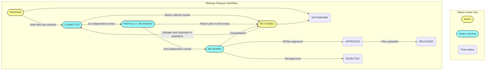

## Permission to view workspace files

Users can view medium privacy outputs from any workspace they have permission to
access (workspaces for which they have the Project Developer role on the Jobs site).

## Permission to create a release request

Users can create a release request from any workspace they have permission to
access. A user can only have at most one active release request at any time.

## Permission to review a release request

Only trained output checkers are allowed to review release requests and release
files to the Jobs site. Output checkers who also have access to a workspace may
create a release request for that workspace, but they will not be able to 
review it.

## The release request workflow

A request moves through a [series of statuses](../reference/request-states.md) during the release request workflow. At each status, the request is considered to
be "owned" by either the researcher (request author) or the output checker. 

During researcher-owned statuses, the researcher can add, withdraw and update
files on a request, and can add or edit file group context, statistical disclosure controls
and comments on a file group. They can also choose to withdraw the request entirely.

During output checker-owned statuses, output checkers can vote on files, and,
depending on the status of the file decision, return the request to the researcher,
reject it, or release files. They can also add comments and questions on file groups.

Researchers and output checkers take it in turns to work on the release request.
We refer to the change from a researcher-owned status to an output checker-owned
status (or vice versa) as a new release request turn.

For example: a researcher creates a new request and adds files to it. The release request is in status PENDING. It is "owned" by the researcher, who can continue
to edit it.

The researcher then submits the request.  The release request is now in status
SUBMITTED. It is owned by the output checkers. The researcher can no longer add or
withdraw files, or comment on file groups. It is now the turn of the output checkers
to work on the request, reviewing files and asking questions where necessary.

A release request moves into APPROVED status when an output checker has clicked the
button to release the files. At this stage, the files have been scheduled for release
and upload to the jobs site. Once all files have been uploaded, the request will
automatically move to the RELEASED status.

The RELEASED, REJECTED and WITHDRAWN statuses are considered final states. When a
release request is in one of these statuses, it cannot be edited by any user, and
it cannot be moved into any other status. 

### Withdrawing files

Files can only be withdrawn by the author of the request and only while the release
request is in the PENDING or RETURNED status.

If a request is in the Submitted or Reviewed state, it should first be returned to
the author in order to withdraw a file.

Once a request reaches the Approved, Released, Rejected, or Withdrawn states,
files can no longer be withdrawn through this mechanism. If it is necessary
to withdraw a file in this case, please refer to the documentation for
[reporting a data breach](https://docs.opensafely.org/releasing-files/#reporting-a-data-breach).

### Updating files
Files can only be updated by the author of the requestand only while the release
request is in the PENDING or RETURNED status.

If a request is in the Submitted or Reviewed state, it should first be returned to
the author in order for files to be updated.

Updating a file will reset any reviews associated with that file.

## Retrictions for authors
Airlock does not permit users to approve or request changes to files that are part of release requests they created themselves.

## Downloading restrictions
Please note that only request files (not workspace files) can be downloaded.
Downloading is permitted **only** for the purposes of output checking.
Request authors are not permitted to download files from their own requests,
even if they are also output checkers.
