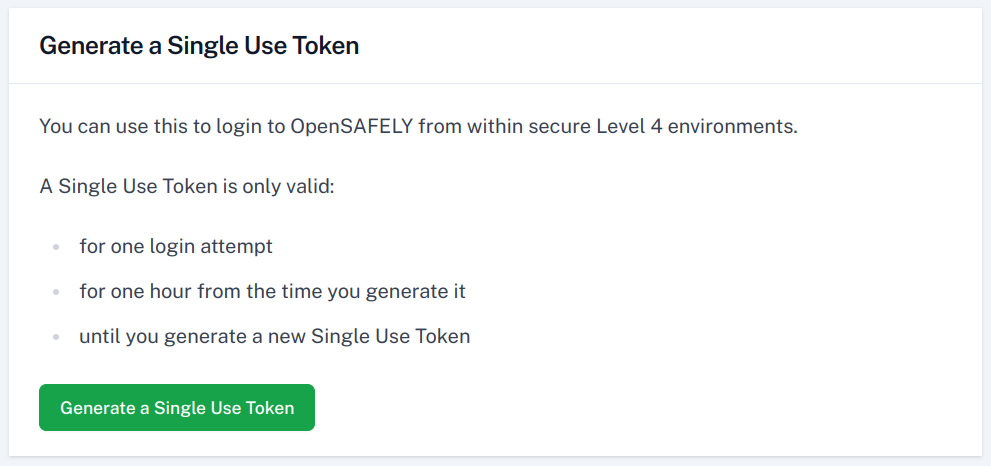
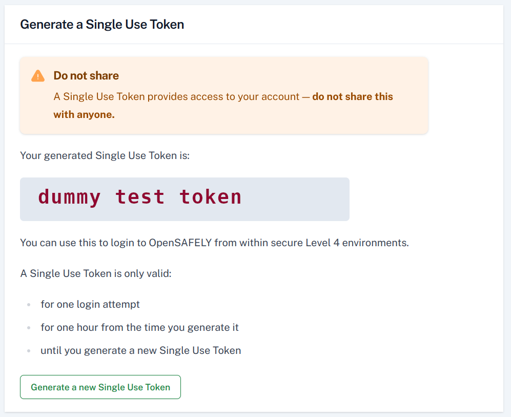
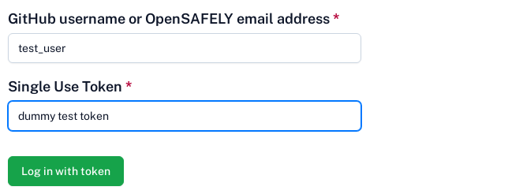

!!!warning "Airlock is only supported in Chrome :fontawesome-brands-chrome:"
    Please ensure you use Chrome when accessing Airlock. Features
    may not work as expected in other browsers.

You will use your OpenSAFELY email address or your GitHub username to log in. These are
the same credentials you use to access the Jobs website.

However, whilst normally you log into https://jobs.opensafely.org from your browser using GitHub,
the secure server does not have access to GitHub. So you need to use an alternate method to login to Airlock, by generating a Single Use Token via the Jobs site, and then using it on the secure
server to log in to Airlock.

## Obtain a single use token via the Jobs site

**Before logging into the secure server**, visit https://jobs.opensafely.org/settings/, and click on "Generate a Single Use Token". This will be 3 english words, which you can memorize or write down. This token can be used to log in as you, but is only valid for a short time, and only works once.

## Log in to the secure server

Now that you have your single use token, log into the server via the VPN.

## Log in to Airlock

Navigate to Airlock using Google Chrome. Airlock is accessed at `https://<backend>.backends.opensafely.org`.
e.g. on the TPP backend, go to `https://tpp.backends.opensafely.org`.

Log in using your GitHub username or OpenSAFELY email and the Single Use Token from the above step.

You should be now logged in. This login will expire after two weeks of not being used.

---

* Next: [View workspace files](view-workspace-files.md)
