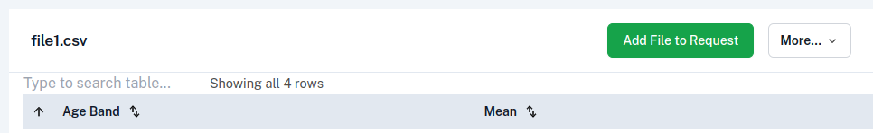
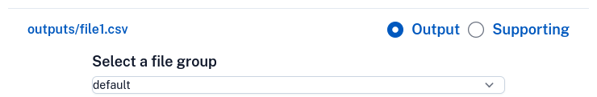
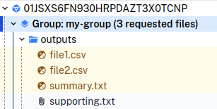
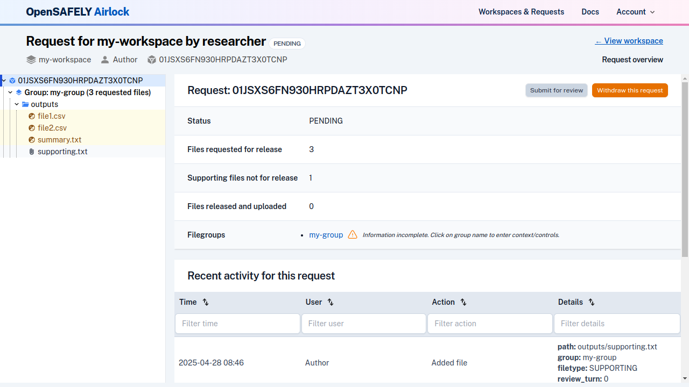
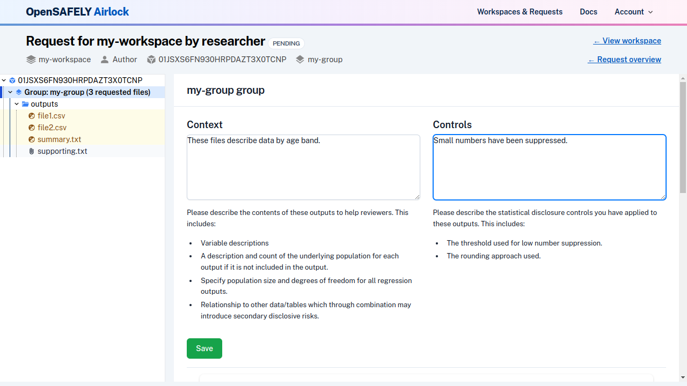
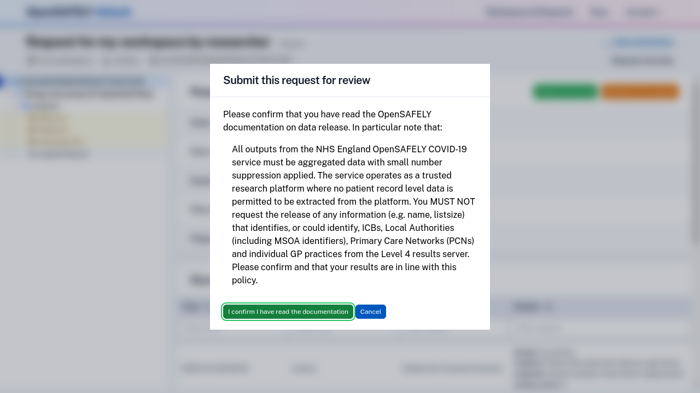
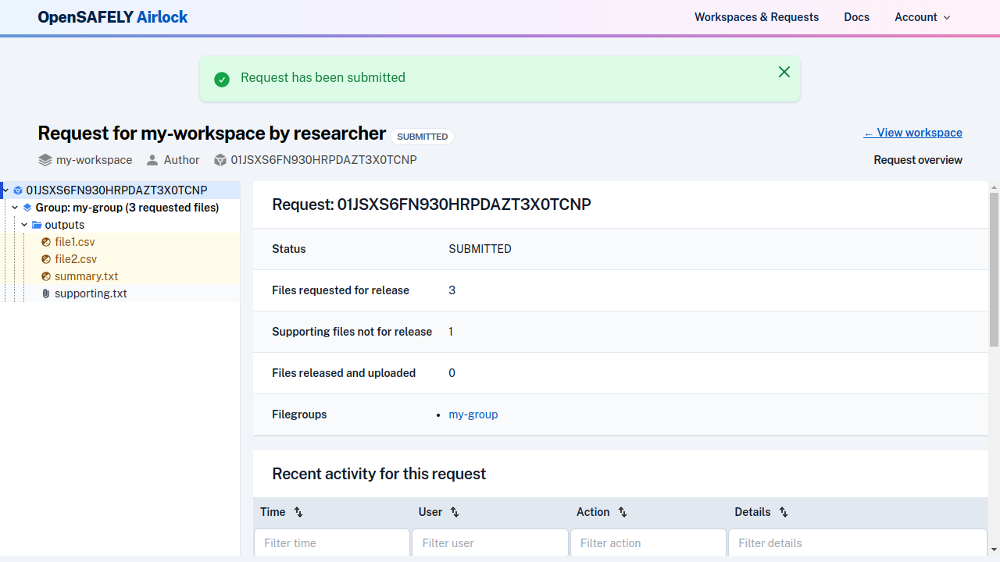

Researchers construct a release request by adding, and if necessary, withdrawing
files.

## Adding files

While [navigating a workspace](view-workspace-files.md), files can be added to a request in
two ways:

- individual files can be added while viewing the workspace file
- Multiple files can be added while viewing the directory containing the files

From a file view, click on the "Add file to Request" button.

From a directory view, select the files you wish to add and click the "Add files to Request" button.

In the dialogue that opens, specify the file group you wish to add the file(s) to, and
select the type of file (output file or supporting file).

!!! note
    You can only have one active release request for a workspace at any one time. If you
    already have an active release request, the file will be added to it. If you do not have
    an active release request, a new one will be created.

If you added a file that you did not intend to, you can
[withdraw the file](edit-file-on-request.md#withdraw-a-file) prior to submitting the release request.

## Navigating the request

After your request has been created, you will see a link to the current request in the
workspace header. Click on this to access the request.

Alternatively, use the link in the navigation bar to view a list of all your requests.

Files in a request are organised in a tree structure within each file group, similarly
to workspaces, and can be navigated in the same way.

Output and supporting files are [differentiated in the tree by colour and icon](../reference/file-icons.md), as shown above.

## Add file group context and statistical disclosure controls

Context and controls must be added to each file group before the release request
can be submitted.

To add context and controls to a group, navigate to the current release request. A
list of the file groups on the request will be shown in the request overview, and
any groups with incomplete context and controls will be highlighted.

Click on the name of the relevant group. 

Enter your context and controls in the text boxes and click Save. 

## Submit the request

Navigate to the request overview by clicking the link in the header or by clicking on the
root of the file browser tree.

Click on the "Submit for review" button. You will need to read and confirm that you have
met the conditions for submission before completing the submission.

Your release request's status will transition to "Submitted", and you will no longer be
able to edit it. Output checkers will be [automatically notified](../explanation/notifications.md) that the request is ready for review.

If you have made a mistake on a submitted request, you can contact the output checkers. They will be able to return the request so you can make changes.
