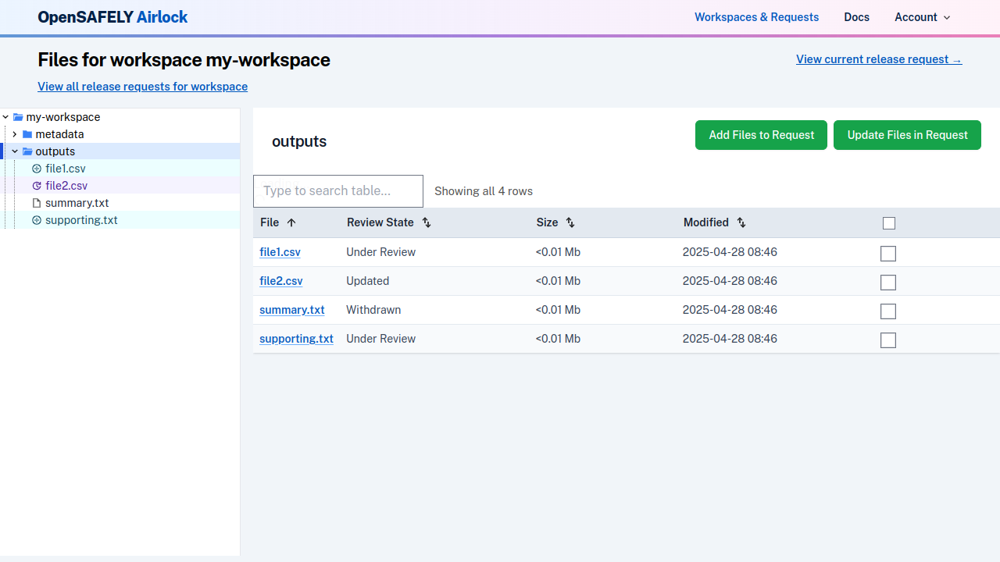
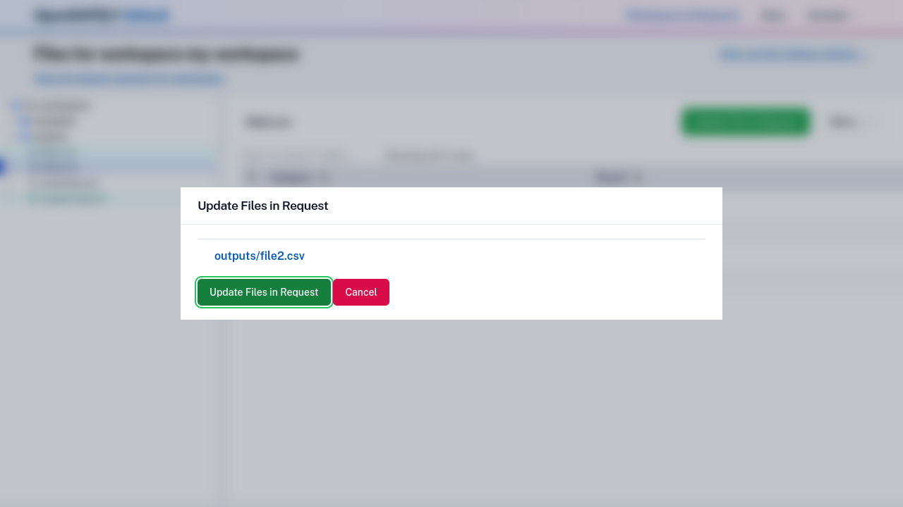
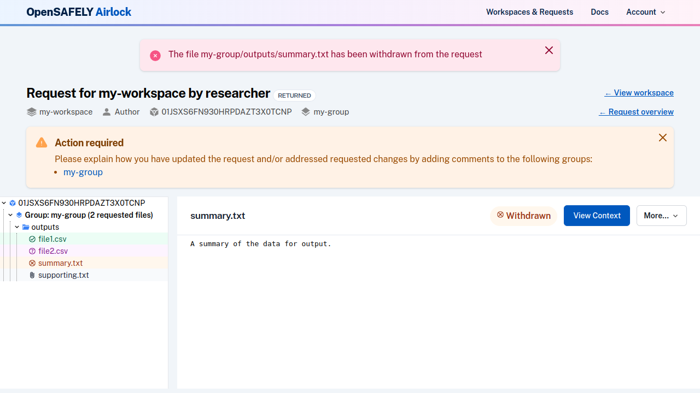

!!! info
    Files can only be added, updated or withdrawn when the request is in the Pending or Returned
    status. See the documentation on [workflow and permissions](../explanation/workflow-and-permissions.md)
    for further information.

## Update a file

If a workspace file has changed after it has been added to a request, it will
be displayed in the workspace view. In the file browser tree, changed files are
indicated with the colour and icon below:

The directory that contains the changed file will also indicate in the "Review State"
metadata that it has been updated.

To update a file, [navigate to the workspace](view-workspace-files.md).
Files can be updated from the file view or the directory view.

Use the "Update file(s)" button to update the file with the new content. Note that
in the dialogue that opens, there is no option to
[change the file group](#move-a-file-to-a-different-group) or [file type](#change-a-file-type).

## Withdraw a file

To withdraw a file, navigate to view the file within the release request,
and use "Withdraw from Request".

If the request is in Pending status, the file is removed from the request entirely.

If the request is in Returned status, the file will still be visible on the request, but marked as withdrawn. 

In either case, the file can be [re-added](create-and-submit-a-release-request.md#adding-files) from the workspace view,.

## Change a file type

In order to change a file type (e.g. change a file initially added as an output file to a
supporting file), first [withdraw the file](#withdraw-a-file) from the request and then
[add it again](create-and-submit-a-release-request.md#adding-files) with the new file type.

## Move a file to a different group

In order to move a file to a different file group, first [withdraw the file](#withdraw-a-file)
from the request and then [add it again](create-and-submit-a-release-request.md#adding-files)
with the new file group.

---

* Previous: [Respond to a returned request](respond-to-returned-request.md)
* Next: [Withdraw a release request](withdraw-request.md)
