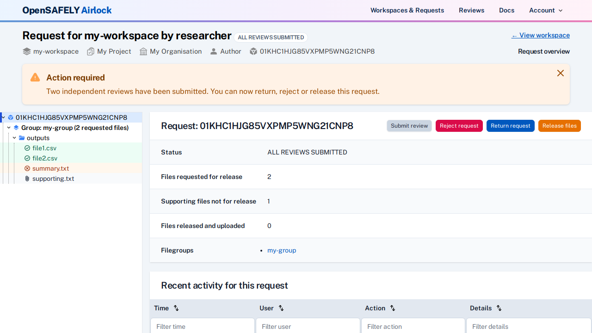
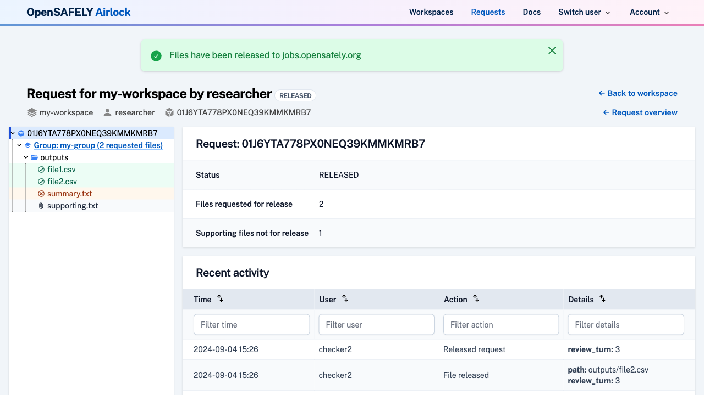

When all output files in a release request have either been approved by two separate
output checkers or withdrawn, the request can be released to the jobs site.

Navigate to the request overview page; a message will indicate that independent
review has been completed and the files can be released.

!!! Note
    The option to release files is not enabled until all requested output files in a
    release request have been approved.

Clicks the "Release Files" button to start the release process. 

The release request [transitions to the "Approved" state](../reference/request-states.md). Once all files have been uploaded to the jobs site, the
release request will move to the "Released" state.

!!!info "Files excluded from release"
    Supporting files and withdrawn output files will not be released.
    
