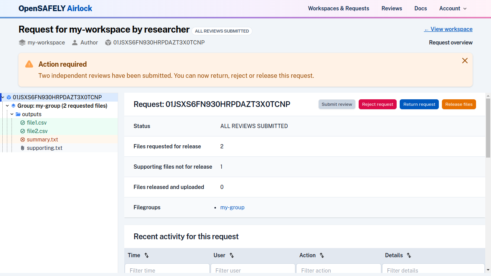
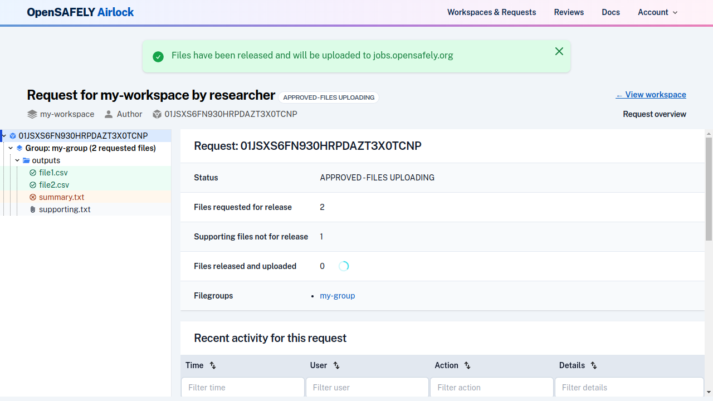
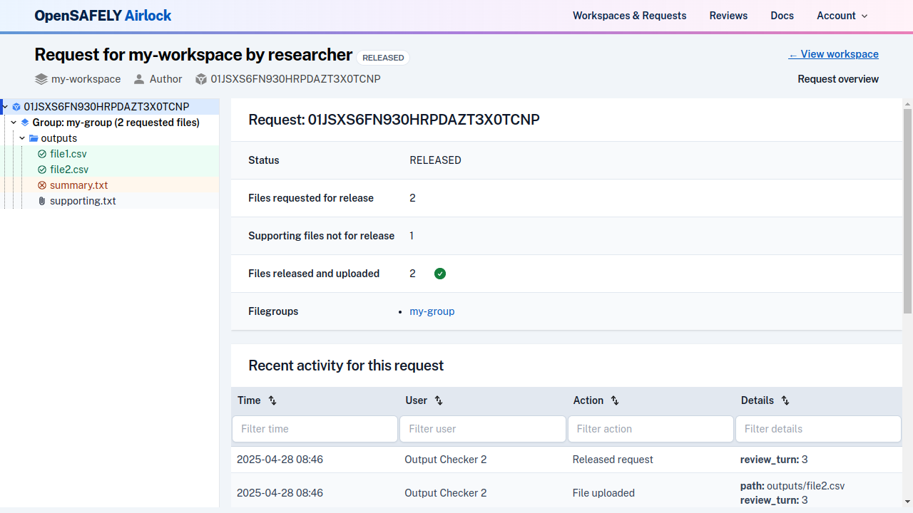

When all output files in a release request have either been approved by two separate
output checkers or withdrawn, the request can be released to the jobs site.

Navigate to the request overview page; a message will indicate that
independent review has been completed and the files can be released.

!!! Note
    The option to release files is not enabled until all requested output files in a
    release request have been approved, and both reviewers have submitted their reviews.

Click the "Release Files" button to start the release process. 

The release request [transitions to the "Approved" status](../reference/request-states.md). In
the background, the files will be uploaded to the jobs site. While this happens, you will see
a count of uploaded files on the request overview page, and an in-progress spinner icon that
indicates the files are still uploading.

Airlock will attempt to upload each output file a limited number of times. If all file
uploads have been attempted, and some files have failed to release, you will see a failed
icon next to the uploaded file count. The "Re-release files" button is now enabled, and you can attempt to re-release. This will re-try the uploads for any files that have failed.

Once all files have been uploaded to the jobs site, the release request will [move to the "Released" status](../reference/request-states.md).

!!!info "Files excluded from release"
    Supporting files and withdrawn output files will not be released.
