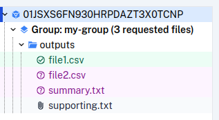
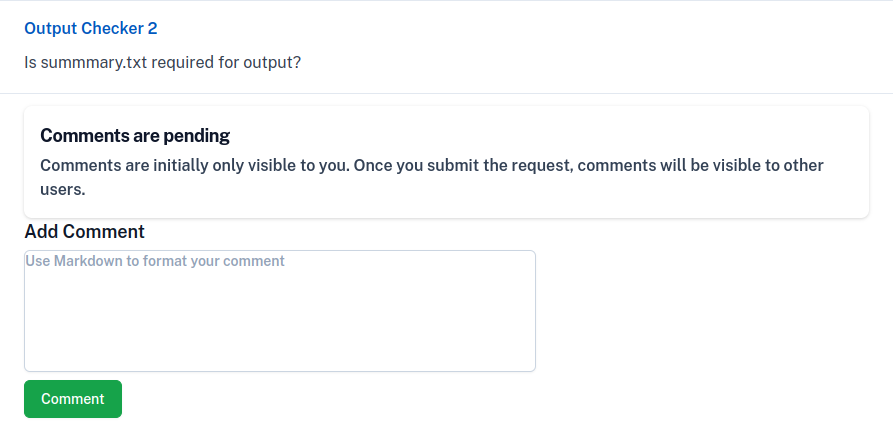

After output checkers have reviewed a release request, they may have questions, or they may
request changes to some of the output files. They do this by *commenting* on the request, and
then *returning* it to the researcher. You will receive a [notification](../explanation/notifications.md)
by email when a request has been returned to you.

Access your release request; in the list of requests, you will see it indicated with the
status **Returned**.

## File review status

In the file browser view, you can see the reviewed status of each of your output files.

In the tree view, files are coloured according to status. This request has one approved
file and one file with changes requested:

## Comments

Navigate to each of your file groups to view comments from the output checkers. You should add
comments to respond to any questions or requests for information. Note that your comments will
not be visible to output checkers until you have submitted the request again for review

## Responding to requests for changes to files

You can opt to respond to a request to change a file by:

1. [Withdrawing the file](edit-file-on-request.md#withdraw-a-file) (and potentially adding a different file or files)
2. Re-running a job and [updating the file](edit-file-on-request.md#update-a-file)
3. Leaving the file as is, and adding a comment to indicate why you have chosen to do so.

## Re-submitting the request

When you are happy that you have responded to feedback and questions, 
[submit the request](create-and-submit-a-release-request.md#submit-the-request) again for review.

---
* Previous: [Create and submit a release request](create-and-submit-a-release-request.md)
* Next: [Edit a file on a request](edit-file-on-request.md)

---8<-- 'airlock-includes/glossary.md'

