Two output checkers perform must perform an independent review of
each requested file.

## View release requests that require action

Use the navigation bar link to view all requests for review. 

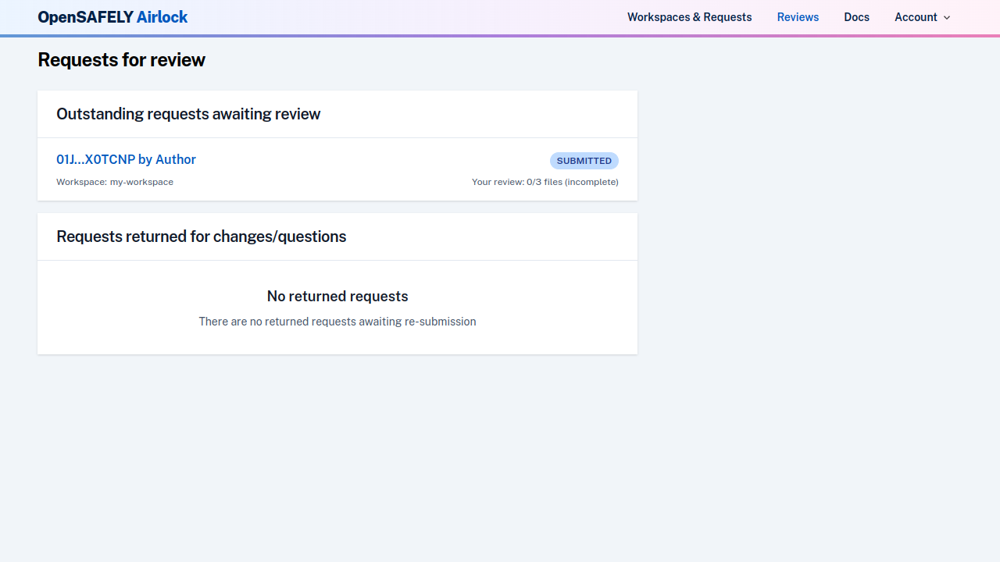

This page shows you any release requests that are currently active.

### Outstanding requests awaiting review
These are requests that have been submitted and are awaiting or under review.
Each request also shows your progress in reviewing the files.

### Requests returned for changes/questions
These requests are currently awaiting updates from the researcher, and do
not require any action from you as an output checker.

Release requests are labelled by release request ID and author. Click on one to
view it.

## View files requested for release

The overview page for a release request displays the status of the
request, and some summary details about the files requested for release.

It also shows a log of recent activity.

This page also contains buttons for various actions that can be performed
on the request as a whole (submitting your review, returning the request to
the researcher etc.).  In the example below, all buttons (except "Return request")
are disabled, as this request has not yet been reviewed.

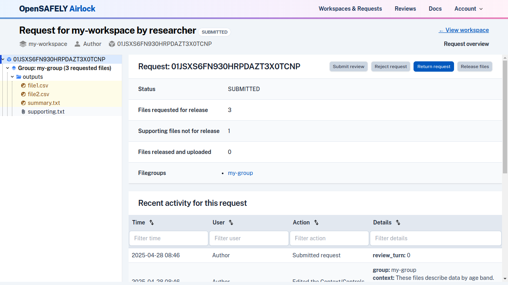

The files in a release request can be browsed in the file browser tree. The
[highlighted colour and icons](../reference/file-icons.md) illustrate the review state of the files.
This request has 3 output files, none of which have been reviewed yet, and
one supporting file, all in a file group called "my-group".

## View file group context and statistical disclosure controls

Click on the file group in the tree to view the file group information.

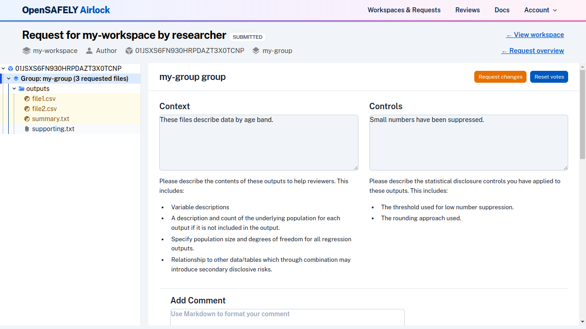

File group information contains the information about the file group context and 
statistical disclosure controls that the researcher has provided for these files. 

## Review files

### View a file content
To review an individual file, click on the file in the tree to display its
content in the browser.

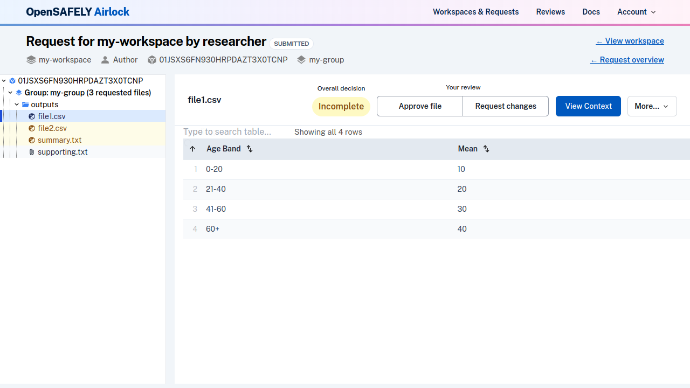

The `More` dropdown also allows you to [view the file in alternative ways](../reference/view-files-alt.md), or to [view the source code](../reference/view-source-code.md) underlying
the file. You can also [download](../reference/downloading-files.md) it if required.

### View file group context, statistical disclosure controls and comments
The context, controls and comments related to this file's file group can be
viewed from the file page by clicking on the Context button.

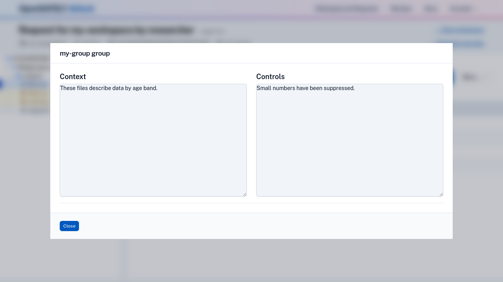

### Vote on a file

Use the buttons at the top of the file content to submit your file vote. Options are:

* **Approve file** — output meets disclosure requirements and is safe to be released
* **Request changes** — output is not currently acceptable for release. 

After approving or requesting changes to a file, the
page will display your file vote, as well as the overall file decision.
Click on the same button again to reset your vote, or click on the
opposite button to change your vote.

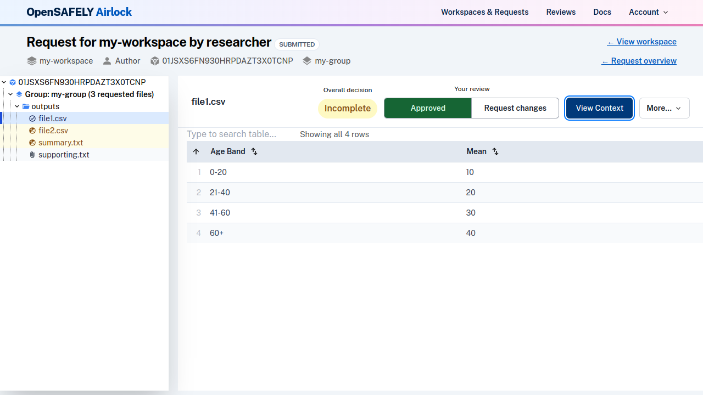

You will see the colours and icons change in the file tree to indicate the
files that you have voted on.

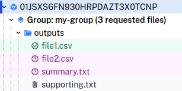

### Add comments

Comments can be added to each file group, to ask questions, or
provide information on why changes have been requested to any files.

If you request changes to a file, you must also add a comment to that file's
group before you can submit your review. When you have reviewed all files, a
message will indicate if there are filegroups missing comments.

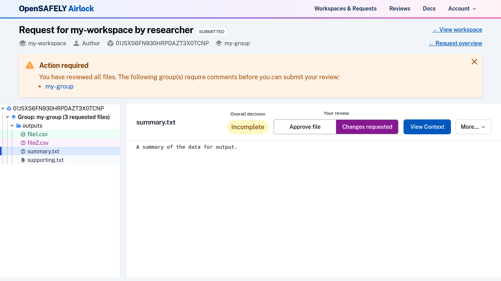

To add a comment, navigate to the file group by clicking on it in
the file browser. Enter your comment text and click Save. You can [write your comments in markdown](../reference/formatting-comments.md) for additional formatting.

You can choose to make a comment public and visible to everyone, or 
private, visible only to other output checkers. In either case, comments are
hidden from the researcher until the request is returned (or approved/released). 

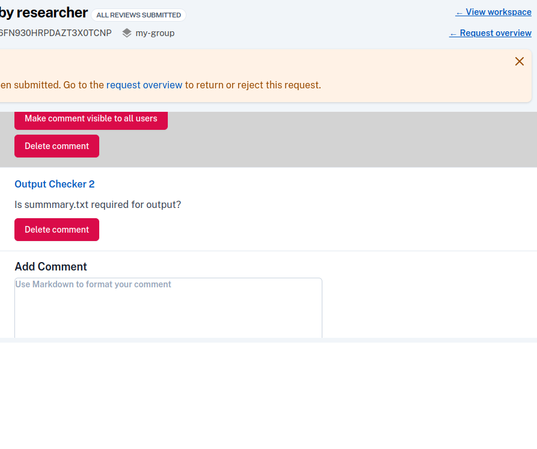

Comments that are created as private can be updated to public at a later stage.
This can be useful during the [review consolidation](#review-consolidation) stage, 
if output checkers agree that the comment contains a question to the researcher that
they would like to ask without revision. 

### Submit your independent review

After you have reviewed all files and added any required comments, you must submit
your review. Navigate to the request overview page, and click the Submit review button,
which will now be enabled.

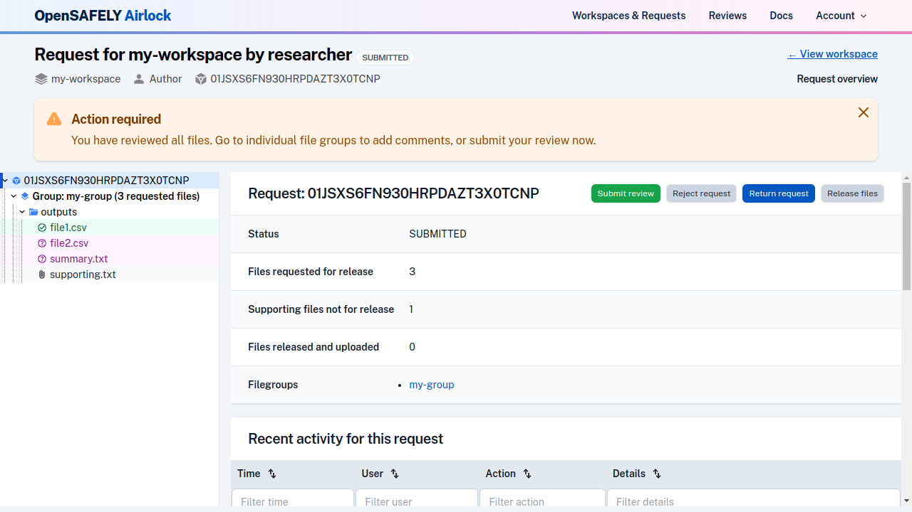

After your review has been submitted, the request status will change.

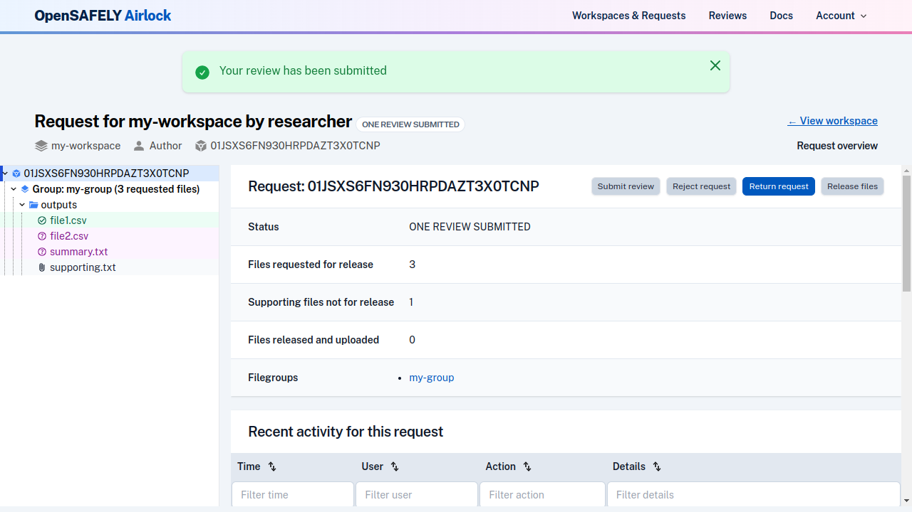

### Review consolidation

Once two independent reviews have been submitted, the request moves into
"Reviewed" status. At this stage, output checkers are able to see the
combined decision on files, and comments that they have each made, and
can discuss and decide how to proceed with the request.

If the output checkers have conflicting votes, they should discuss and
come to an agreement on whether the file(s) require changes. They should
review any comments to determine the set of comments that they intend to 
return to the researcher (if any), and ensure that comments that are to be
made visible to the researcher are consistent and coherent.

While consolidating reviews, more comments can be added, after the output
checkers have discussed and agreed on the questions they need to ask.
If an existing comment already conveys the information requires, its
visibility can be changed to allow it to be made visible to the researcher. 

## Progress the request to the next stage

### Navigate to the request overview page

Navigate to the request overview page by clicking on the request ID in the file tree,
or by clicking on the overview link in the page header.

Depending on the status of the file decisions, you will have the options to:

### Return request to researcher

If there are questions or changes have been requested, you will need to
return the request to the researcher.

In order to return a request with requested changes, you must [add a comment](#add-comments)
that is visible to everyone to the relevant file groups to provide feedback to the
researcher on the changes requested. Once independent review is complete, a message
will indicate if there are filegroups missing public comments.

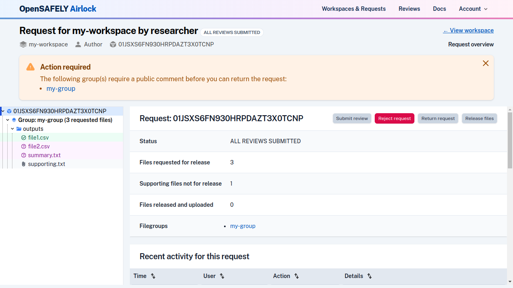

Click the Return request button from the [request overview page](#navigate-to-the-request-overview-page).

!!! note "Returning requests early"
    If you are returning a request early (i.e. before two independent reviews have been
    completed), comments are not enforced. This is because early return is
    usually at the request of the researcher, to make corrections.

### Reject request

On rare occasions, there may be a request that contains data that must not
be released. In this case, you can reject the entire request.

Click the Reject request button from the [request overview page](#navigate-to-the-request-overview-page).

!!! warning
    Rejecting a request cannot be undone.

### Release files

If all files have been approved, they can be [released](release-files.md).

## Re-review of a request

Once a request has been returned, researchers will receive a 
[notification](../explanation/notifications.md), and can make changes,
respond to comments and re-submit the request for re-review. Review
of re-submitted requests follows the same process described above, until
the request is ready for release.
