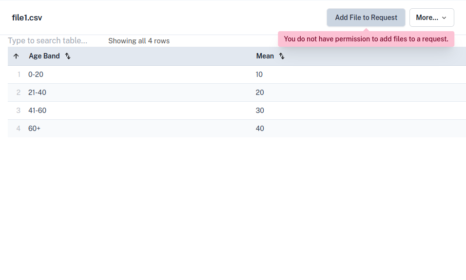

If you are a copilot, you will see an additional link in the navigation bar
for Copiloted Workspaces.

This will show you a list of workspaces that you are a copilot for, organised
by Project.

As a copilot, you will usually not have permission to create or update release requests,
but you can view and navigate files [as described
in the researcher documentation](../how-tos/view-workspace-files.md).

