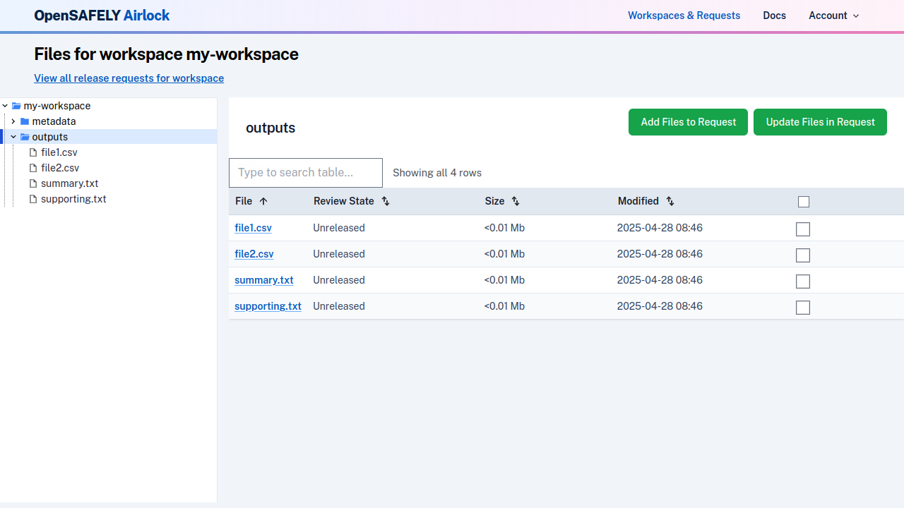
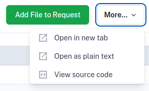

To view files in a workspace, navigate to the Workspaces view using the links in the
navigation bar. This will show you a list of workspaces that you have access to, organised
by Project.

Click on a workspace to view its files. The landing page for a workspace shows some details of the workspace and project. On the left hand side the workspace files are displayed in a
browsable file tree.

Clicking on a directory will display a list of the files it contains, with some metadata
about the file, such as size, type and last modified date.

To view a specific file, click on it in the directory view, or in the file tree. The contents
of the file will be displayed.

From the file view, the `More` dropdown also allows you to [view the file in alternative ways](../reference/view-files-alt.md), or to [view the source code](../reference/view-source-code.md) underlying
the file.

---

* Previous: [Accessing Airlock](access-airlock.md)
* Next: [Create and submit a release request](create-and-submit-a-release-request.md)

---8<-- 'airlock-includes/glossary.md'
