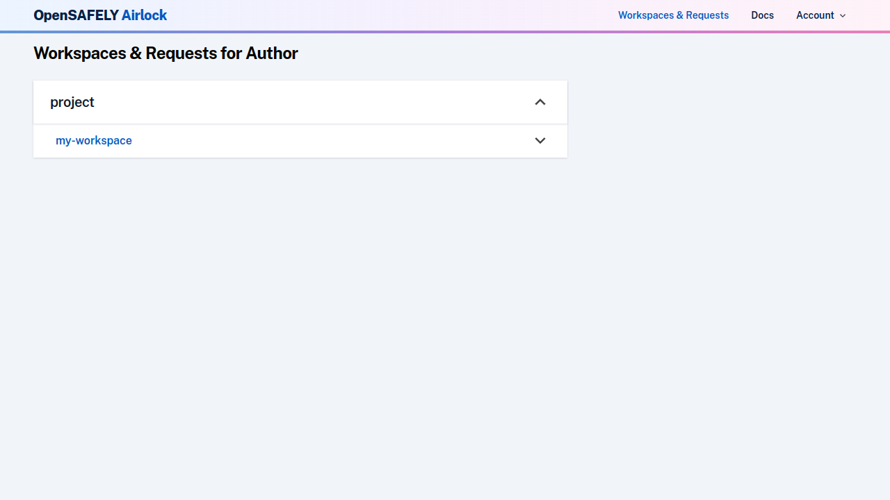
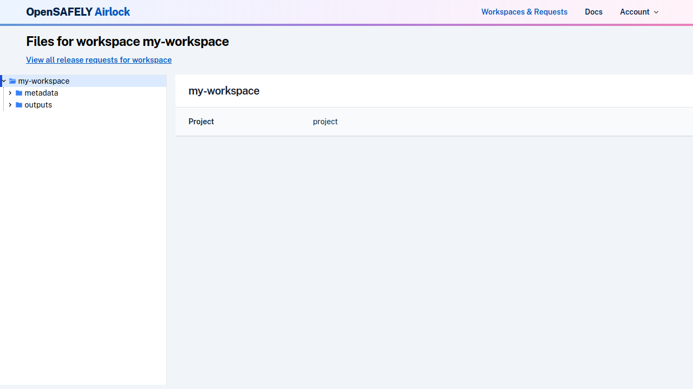
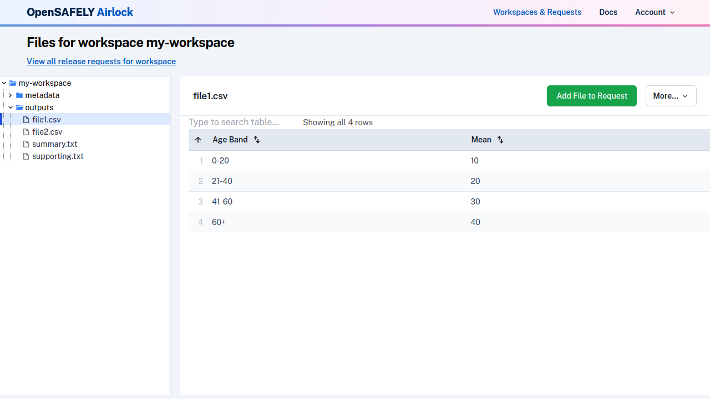

To view files in a workspace, navigate to the 'Workspaces & Requests' view using the links in the
navigation bar. This will show you a list of workspaces that you have access to, organised
by project.

Click on a workspace to view its files. The landing page for a workspace shows some details of the workspace and project. On the left hand side the workspace files are displayed in a
browsable file tree.

The `metadata/` directory contains job log files. These contain the output your
code generated when it last ran, and are useful for debugging issues.

!!!note "Log files may be truncated"
     To reduce risk of accidental disclosure of pseudonymous patient level
     data, only the last few hundred lines of a log file are displayed in
     Airlock. This should allow debugging of any issues. Contact tech support
     if you need access to the full log.

Clicking on a directory will display a list of the files it contains, with some metadata
about the file, such as size, type and last modified date.

To view a specific file, click on it in the directory view, or in the file tree. The contents
of the file will be displayed.

From the file view, the `More` dropdown also allows you to [view the file in alternative ways](../reference/view-files-alt.md), or to [view the source code](../reference/view-source-code.md) underlying
the file.

