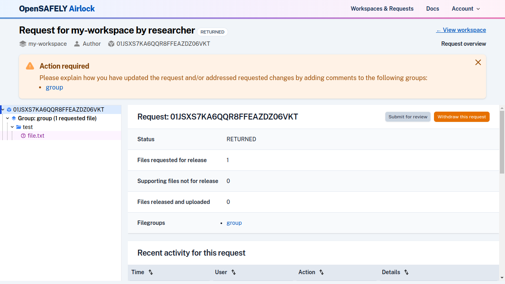
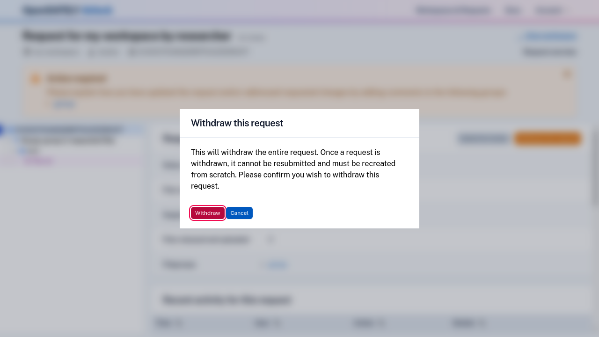

!!! warning
    Withdrawing a request cannot be undone.

When a [release request is in Pending or Returned status](../explanation/workflow-and-permissions.md),
you have the option to withdraw the request.

Navigate to the request overview by clicking the link in the header or by clicking on the
root of the file browser tree.

Click on the "Withdraw request" button. 

You will need to confirm that you really want to do this before proceeding.

