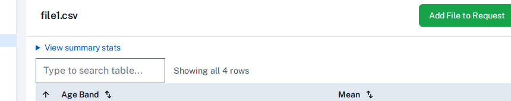
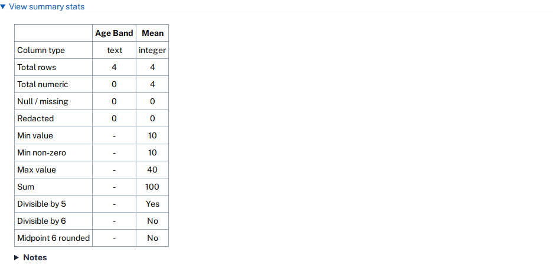
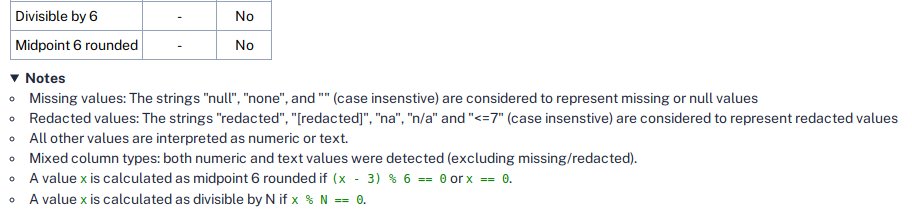

For CSV files, some summary statistics can be viewed by clicking on the "View summary stats" toggle.

This displays a table with details about each column in the CSV file, including its type and counts of
missing and redacted values.

For columns that were detected as containing all numeric values (excluding missing and redacted values),
some common calculations are performed to allow reviewers to check for statistical disclosure controls
that may have been applied. These include:

- minimum value
- minimum value, excluding zero
- maximum value
- sum of all values (useful for checking a column of percentages sums to 100%)
- rounding - whether all values in the column are:
    - divisible by 5
    - divisible by 6 (equivalent to midpoint 6 derived rounding)
    - midpoint 6 rounded

This information is visible to researchers when viewing CSV files in a workspace, and also to output checkers when reviewing CSV files in a request.

Additional information can be viewed by clicking on the "Notes" below the table. 

