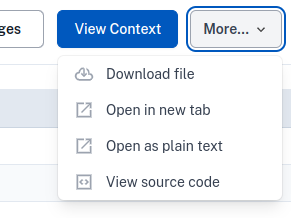

!!! note

    Downloading files is restricted to output checkers who are
    reviewing a request. This option is not available for workspace
    files, or for the author of a release request.

If possible, output checkers should not download files, and should
view them in the airlock browser, or via the [available alternative
methods](view-files-alt.md).

However, if necessary, files on a release request can be downloaded
via the "More" dropdown in the file view.

