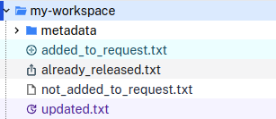
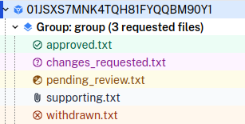
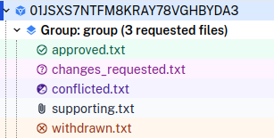

Files in workspaces and requests are identified by different icons
and colours.

## Workspace files

A workspace file may:

* be added to the current request and under review
* have been updated since it was added to the current request
* have already been released (and therefore cannot be added to the request)

The icons and colours of the possible workspace file states are shown below:

## Release request files

### During independent review

During independent review, output checkers see only their own
progress on a request.

 A file on a release request may:

* be approved by the logged-in output checker
* have changes requested by the logged-in output checker
* be pending review by the logged-in output checker
* have been withdrawn from the request
* be a supporting file (which will not be reviewed or released)

The icons and colours of the possible request file states at this stage
are shown below:

During this stage, the researcher will not see the status of the file
reviews, and will see all requested output files as under review:

### After independent review

After both independent reviews have been submitted, output checkers see the
combined status of files on a request. Once the request has been returned to
the researcher, they will also see the combined status.

A file on a reviewed release request may:

* be approved by two independent output checkers
* have changes requested by two independent output checkers
* have conflicting reviews by two independent output checkers
* have been withdrawn from the request
* be a supporting file (which will not be reviewed or released)

The icons and colours of the possible request file states are shown below:

