Comments can be formatted with markdown using the following supported tags: 

- Anchor: To add a hyperlink. 

Markdown                                            |  Rendered Output
:-------------------------:                         |:-------------------------:
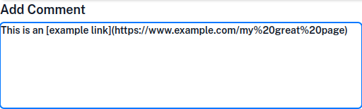 | 

- Bold / Strong

Markdown                                               |  Rendered Output
:-------------------------:                            |:-------------------------:
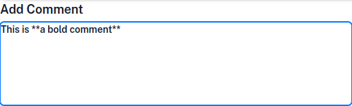 | 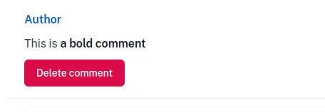

- Block Quote

Markdown                                               |  Rendered Output
:-------------------------:                            |:-------------------------:
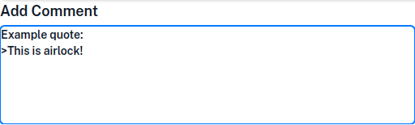 | 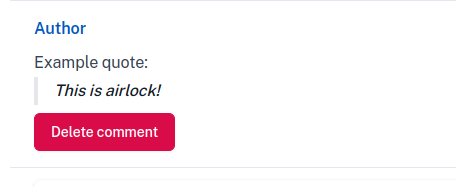

- Code

Markdown                                               |  Rendered Output
:-------------------------:                            |:-------------------------:
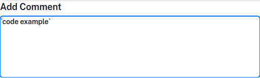 | 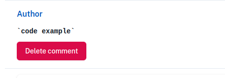

- Italics

Markdown                                               |  Rendered Output
:-------------------------:                            |:-------------------------:
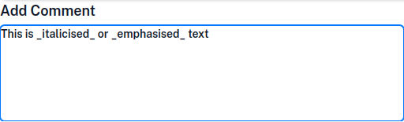 | 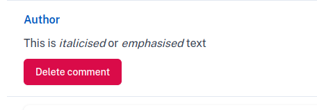

- Ordered lists: The numbers do not need to be in order but must always start with number 1.

Markdown                                               |  Rendered Output
:-------------------------:                            |:-------------------------:
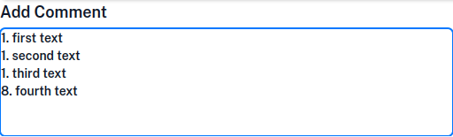 | 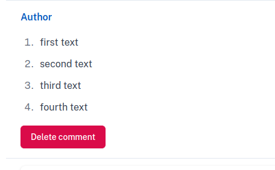

- Unordered lists

Markdown                                               |  Rendered Output
:-------------------------:                            |:-------------------------:
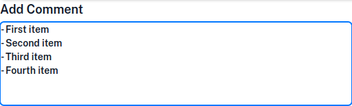 | 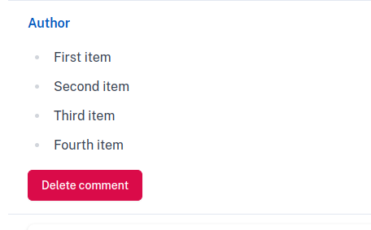

> **Note:**  Abbreviations and acronyms do not have native markdown support.
