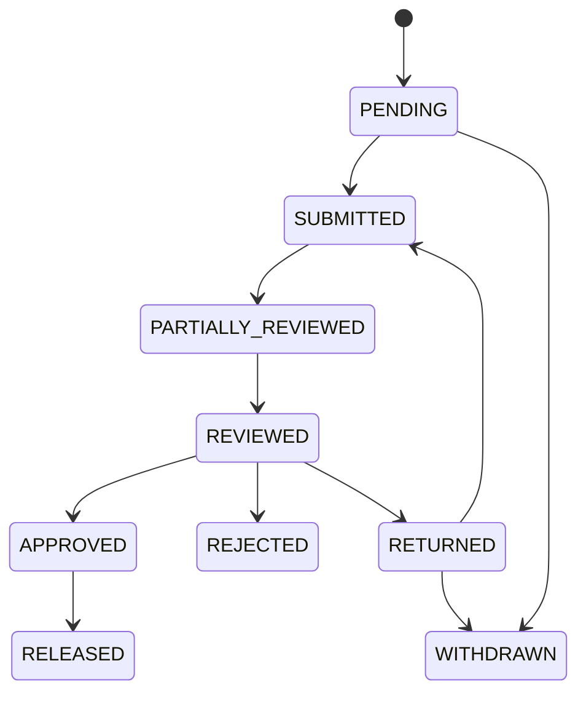

# State machine diagram for RequestStatus

Generated from `BusinessLogicLayer.VALID_STATE_TRANSITIONS` by scripts/statemachine.py

```mermaid
stateDiagram-v2
    [*] --> PENDING
    PENDING --> SUBMITTED
    PENDING --> WITHDRAWN
    SUBMITTED --> PARTIALLY_REVIEWED
    PARTIALLY_REVIEWED --> REVIEWED
    REVIEWED --> APPROVED
    REVIEWED --> REJECTED
    REVIEWED --> RETURNED
    RETURNED --> SUBMITTED
    RETURNED --> WITHDRAWN
    APPROVED --> RELEASED
```

