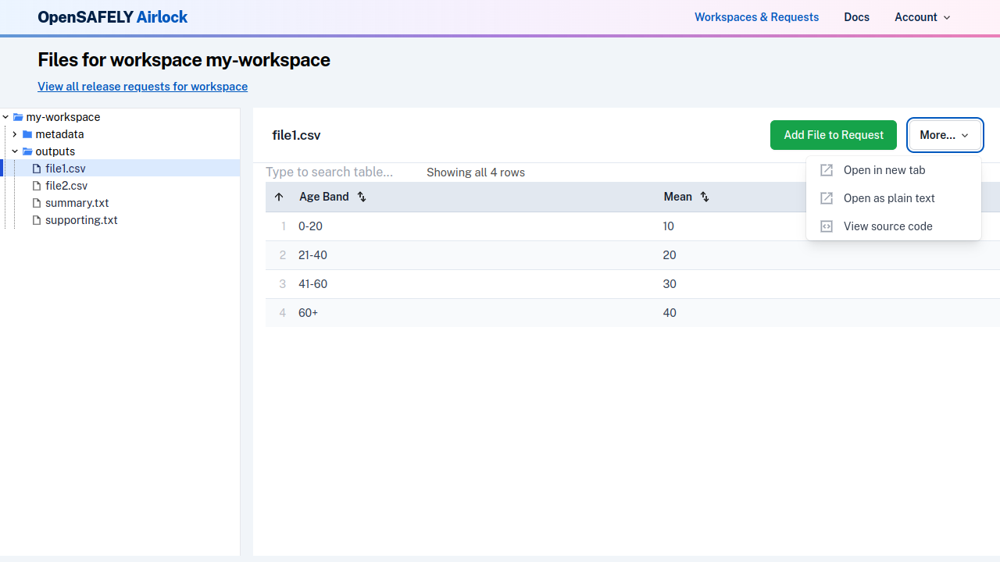

Workspace and request files can be viewed in the Airlock browser. Two alternative ways of viewing a 
file are provided via the `More` dropdown in the file view.

## View a file in a new tab
Some files, especially tables, may be easier to view in their own window.

From the file view, use the `More` dropdown to view a file in a new tab. This will open just the
file content, with more space for viewing.

## View a file in plain text
Files in the Airlock file viewer are formatted according to their file type. For example, CSV
files are displayed as a filterable and sortable table. If you wish, you can also view the
file content in its raw form, by selecting "View as plain text" in the `More` dropdown.

---8<-- 'airlock-includes/glossary.md'
