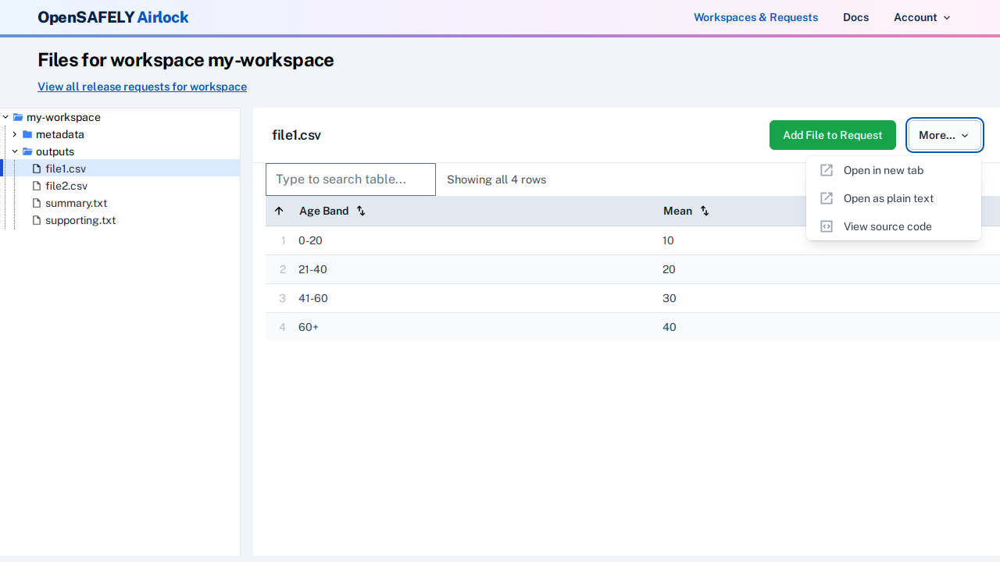
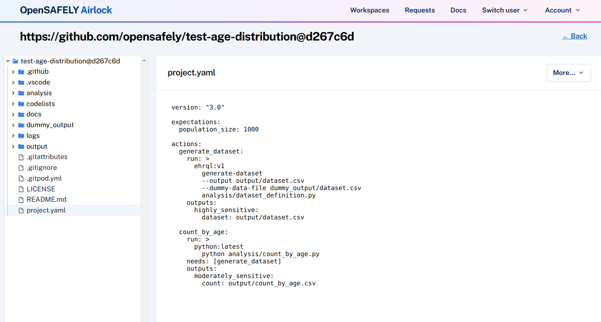

You can view the code underlying a workspace or request file via the `More` dropdown in the file
view.

Clicking on`View code` opens a new tab with a view of the files in the GitHub repo that the
workspace is connected to. 

!!! note
    The version of the repo files corresponds to the state of the repo
    *at the commit when the job was run*. 

